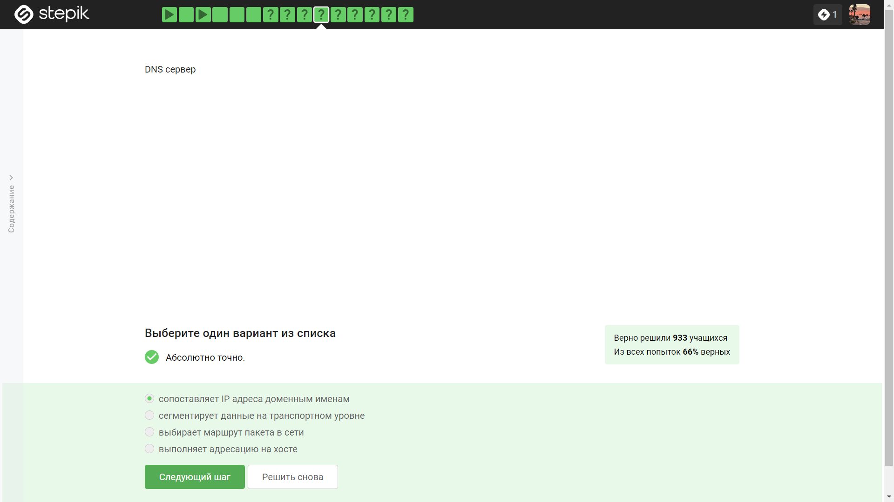
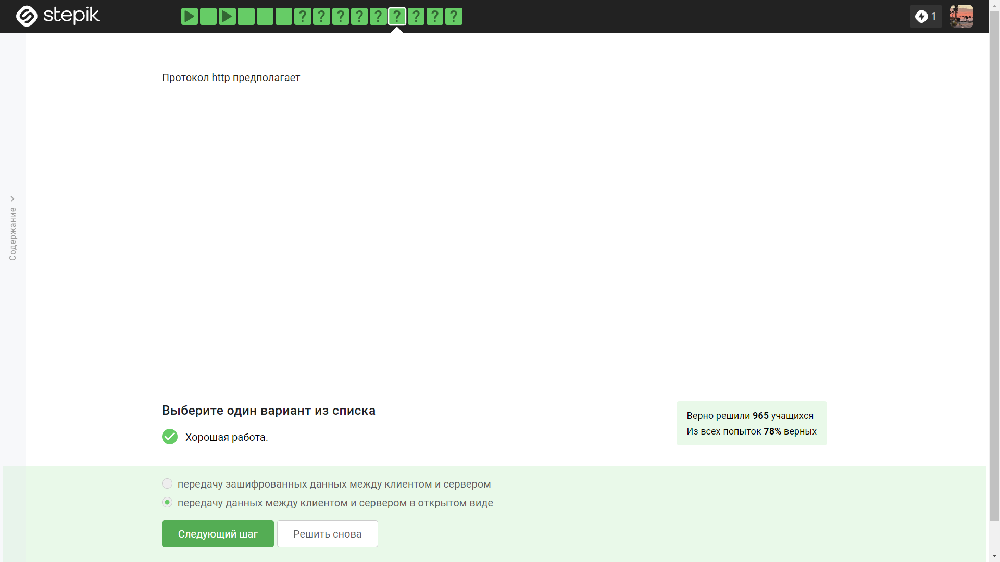
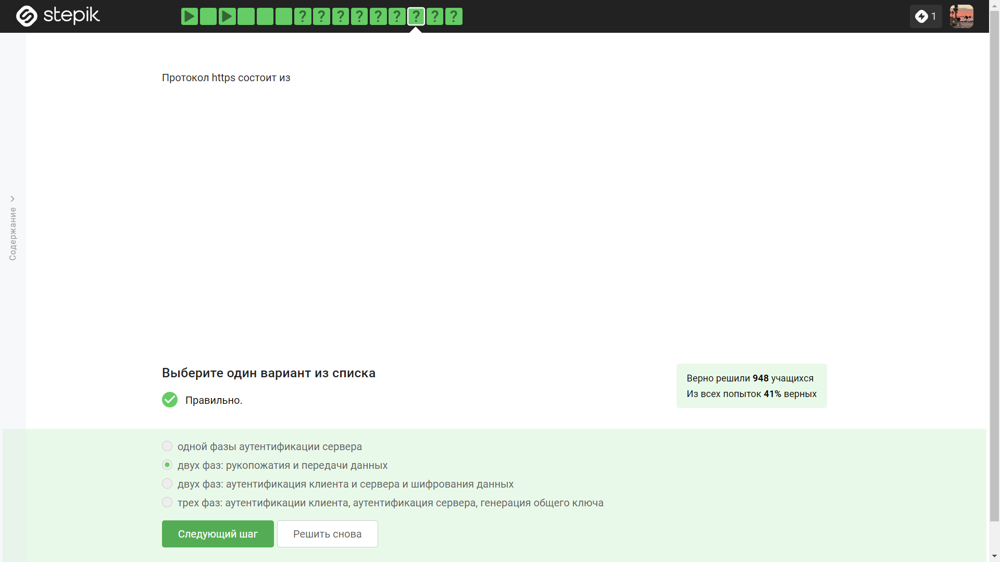
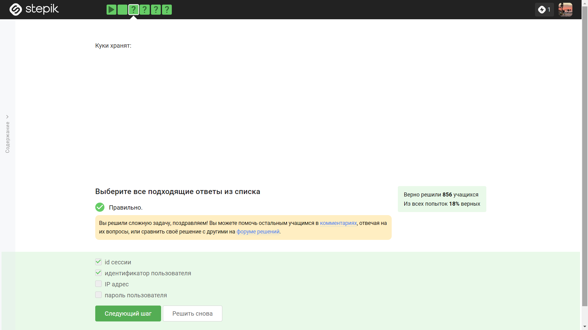

---
## Front matter
title: "Внешний курс раздел 1"
subtitle: "Безопасность в сети"
author: "Кудряшов Артём Николаевич"

## Generic otions
lang: ru-RU
toc-title: "Содержание"

## Bibliography
bibliography: bib/cite.bib
csl: pandoc/csl/gost-r-7-0-5-2008-numeric.csl

## Pdf output format
toc: true # Table of contents
toc-depth: 2
lof: true # List of figures
lot: true # List of tables
fontsize: 12pt
linestretch: 1.5
papersize: a4
documentclass: scrreprt
## I18n polyglossia
polyglossia-lang:
  name: russian
  options:
	- spelling=modern
	- babelshorthands=true
polyglossia-otherlangs:
  name: english
## I18n babel
babel-lang: russian
babel-otherlangs: english
## Fonts
mainfont: PT Serif
romanfont: PT Serif
sansfont: PT Sans
monofont: PT Mono
mainfontoptions: Ligatures=TeX
romanfontoptions: Ligatures=TeX
sansfontoptions: Ligatures=TeX,Scale=MatchLowercase
monofontoptions: Scale=MatchLowercase,Scale=0.9
## Biblatex
biblatex: true
biblio-style: "gost-numeric"
biblatexoptions:
  - parentracker=true
  - backend=biber
  - hyperref=auto
  - language=auto
  - autolang=other*
  - citestyle=gost-numeric
## Pandoc-crossref LaTeX customization
figureTitle: "Рис."
tableTitle: "Таблица"
listingTitle: "Листинг"
lofTitle: "Список иллюстраций"
lotTitle: "Список таблиц"
lolTitle: "Листинги"
## Misc options
indent: true
header-includes:
  - \usepackage{indentfirst}
  - \usepackage{float} # keep figures where there are in the text
  - \floatplacement{figure}{H} # keep figures where there are in the text
---

# Цель работы

Изучить основы безопасности в сети.

# Выполнение работы

1. Единственным протоколом прикладного уровня из списка является протокол HTTPS.

{#fig:001 width=70%}

2. Протокол TCP работает на транспортном уровне.

{#fig:001 width=70%}

3. В 8 битах 256 разных значений, но нумерация идет с нуля и как итог, допустимые значения в IP адресе - с 0 до 255.

{#fig:001 width=70%}

4.  Основная задача DNS-сервера - это сопоставить название, то есть доменное имя, с корректным IP-адресом, с тем, где лежит этот сервер, этот сайт. 

{#fig:001 width=70%}

5. Корректная последовательность протоколов в модели TCP/IP: прикладной-транспортный-сетевой-канальный.

{#fig:001 width=70%}

6. Протокол http, в отличие от протокола https, предполагает передачу данных между клиентом и сервером в открытом виде. 

{#fig:001 width=70%}

7. Протокол https состоит из двух фаз: рукопожатия (handshake) и передачи данных.

{#fig:001 width=70%}

8. Версия протокола TLS определяется и клиентом, и сервером в процессе "переговоров".

{#fig:001 width=70%}

9. В фазе рукопожатия не предусмотрено шифрование данных, так как эта фаза является вводной перед защищенной передачей данных. 

{#fig:001 width=70%}

10. Куки хранят id сессии, идентификатор пользователя, пароль и IP адрес они не хранят.

{#fig:001 width=70%}

11. Куки не используются для улучшения надежности соединения, они с соединением пользователя никак не связаны.

{#fig:001 width=70%}

12. Куки генерируются сервером для клиента.

{#fig:001 width=70%}

13. Сессионные куки хранятся в браузере до конца сессии, то есть на время пользования веб-сайтом.

{#fig:001 width=70%}

14. В луковой сети TOR 3 промежуточных узла: охранный, промежуточный и выходной.

{#fig:001 width=70%}

15. В TOR IP-адрес получателя известен лишь отправителю и выходному узлу, это одна из причин почему TOR считается конфиденциальной сетью.

{#fig:001 width=70%}

16. Отправитель генерирует общий секретный ключ со всеми тремя узлами: с охранным, с промежуточным, с выходным. Этот процесс делает передачу данных крайне защищенной. 

{#fig:001 width=70%}

17. Для получения пакетов через луковую маршрутизацию необязательно использовать браузер, основанный на луковой маршрутизации, это обязательно для отправителя пакетов.

{#fig:001 width=70%}

18. Согласно определению, Wi-Fi - это технология беспроводной локальной сети, работающая в соответствии со стандартом IEEE 802.11. 

{#fig:001 width=70%}

19. Протокол Wifi работает на самом нижнем, канальном уровне.

{#fig:001 width=70%}

20. Небезопасным методом обеспечения шифрования и аутентификации в сети Wifi является WEP, так как он устарел, в частности, потому, что использовал малую длину ключа: так, например, он использовал длину ключа в 40 бит, это довольно мало на сегодняшний день, он может быть легко взломан.

{#fig:001 width=70%}

21. Данные между хостом сети (компьютером или смартфоном) и роутером передаются в зашифрованном виде после аутентификации устройств.

{#fig:001 width=70%}

22. Для домашней сети для аутентификации обычно используется метод WPA2 Personal, WPA2 Enterprise используется для корпоративных сетей.

{#fig:001 width=70%}

# Выводы

Я изучил основы безопасности в сети.

# Список литературы

Конспекты к лекциям курса "Основы кибербезопасности".
