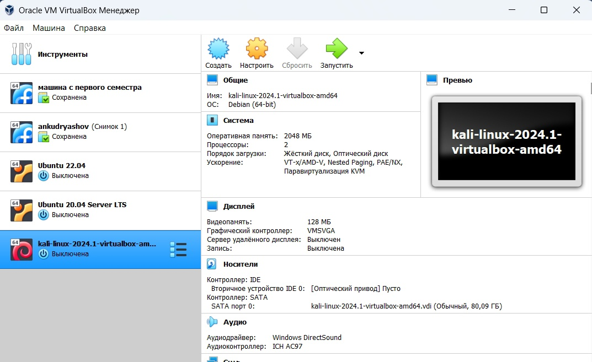
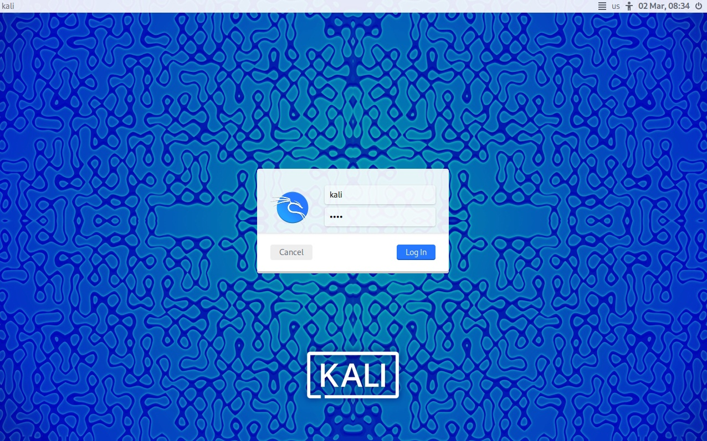
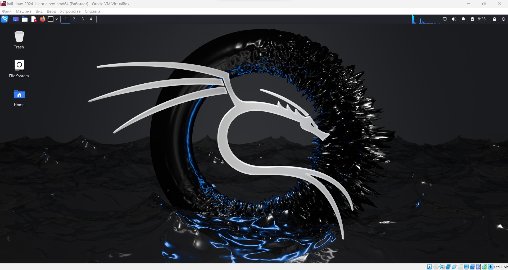

---
## Front matter
lang: ru-RU
title: "1 этап индивидуального проетка"
subtitle: "Установка Kali Linux"
author:
  - Кудряшов А.Н.
institute:
  - Российский университет дружбы народов, Москва, Россия
date: 02 марта 2024

## i18n babel
babel-lang: russian
babel-otherlangs: english

## Formatting pdf
toc: false
toc-title: Содержание
slide_level: 2
aspectratio: 169
section-titles: true
theme: metropolis
header-includes:
 - \metroset{progressbar=frametitle,sectionpage=progressbar,numbering=fraction}
 - '\makeatletter'
 - '\beamer@ignorenonframefalse'
 - '\makeatother'
---

# Информация

## Докладчик

:::::::::::::: {.columns align=center}
::: {.column width="70%"}

  * Кудряшов Артём Николаевич
  * студент группы НКАбд-02-22
  * Российский университет дружбы народов
  * [1132226433@pfur.ru](mailto:1132226433@pfur.ru)
  * <https://github.com/ankudryashovNKA>

:::
::: {.column width="30%"}

:::
::::::::::::::

# Вводная часть

## Актуальность

- Выполнение первого этапа индивидуального проекта по курсу Основы информационной безопасности

## Цели и задачи

- Установить Kali Linux, авторизоваться

# Основная часть

## Процесс выполнения 1

Зайдём на официальный сайт Kali и скачаем нужный файл.

{#fig:001 width=70%}

## 2

Распакуем и запустим скачанный файл, сразу открывается приложение VirtualBox.

{#fig:002 width=70%}

## 3

Войдём в систему с помощью учётной записи:
  - Логин: kali
  - Пароль: kali

{#fig:003 width=70%}

## 4

Как мы видим, установка прошла успешно.

{#fig:004 width=70%}

## Результаты

В ходе выполнения данного этапа индивидуального проекта мы установили Kali Linux на VirtualBox и вошли в систему.
  
## Итоговый слайд

Опыт работы в Kali Linux может быть очень полезен.

## Список использованной литературы

1. Этапы выполнения индивидульного проекта, Д.С. Кулябов.

